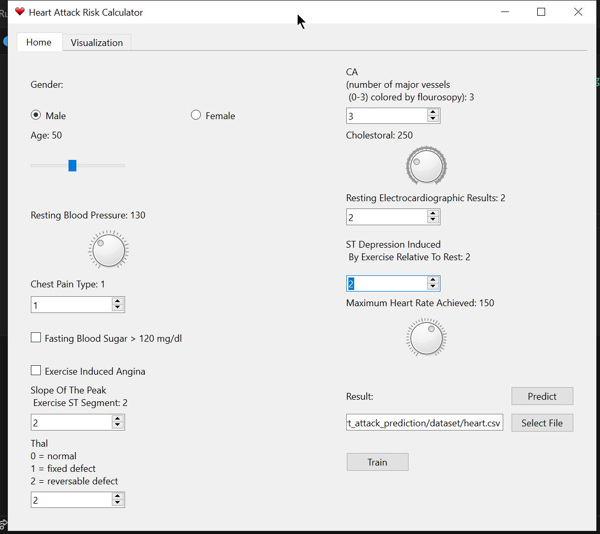
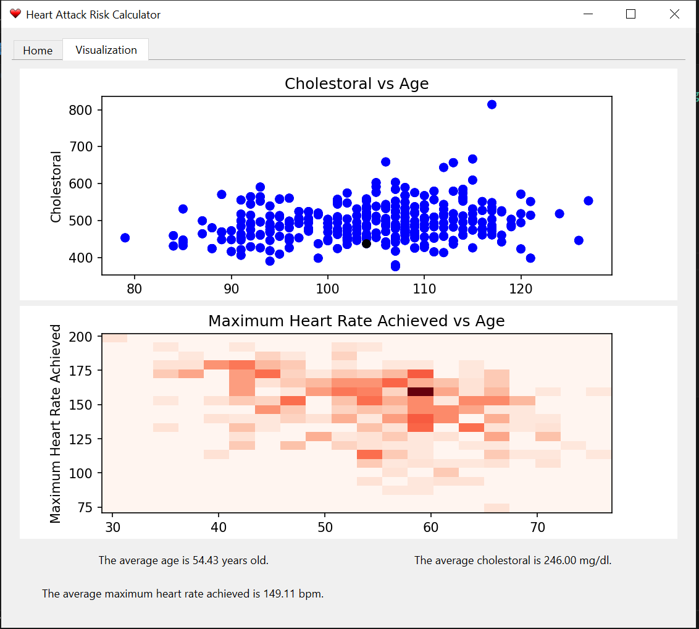

# Heart Attack Risk Prediction

This is a simple PyQt6-based application for predicting heart attack risk using a machine learning model. The application has two tabs: "Home" and "Visualization". The "Home" tab allows users to input various health-related parameters, and the "Visualization" tab displays visualizations based on the provided dataset.

 | 
:-------------------------:|:-------------------------:
*Home Tab*  | *Visualization Tab 2*

## Features
- Gender selection (Male/Female)
- Age slider
- Input fields for various health parameters
- Data visualization based on the dataset
- Model training and prediction

## Requirements
- PyQt6
- pandas
- numpy
- matplotlib
- scikit-learn (assumed to be in the `model.py` file)
- Heart attack dataset in CSV format

# Installation
## Setup the virtual environment

    python -m venv .\venv

## Activate the virtual environment

    .\venv\Scripts\activate

## Install the required packages

    pip install -r .\requirements.txt

# Basic Usage

    python .\gui.py

## Dataset
The application assumes that you have a heart attack dataset in CSV format. The dataset should contain columns like age, gender, chest pain type, cholestoral, etc.

## Note
- The application provides a basic overview of the dataset in the "Terminal" dialog.
- Make sure to customize the color-coding and other visual aspects based on your preferences.

Feel free to modify and extend the code according to your specific requirements.
